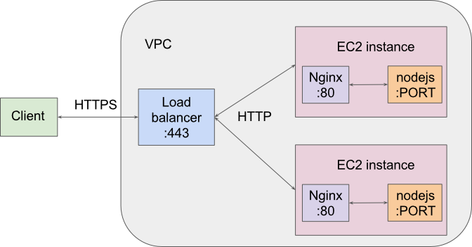

[Back to Home](Home)

# Deployment

General deployment instructions using AWS Elastic Beanstalk (EB) and Codeship.

## The general idea

Skip this section if you're not interested in knowing what's going on.

EB adds a load balancer between the client and the instances which are running
the server code. The deployment setup described here configures HTTPS between
the client and EB's load balancer, and HTTP between the balancer and the
EC2 instances. Therefore, this **is not end-to-end encryption**.

Another important detail is that the EC2 instances run a proxy server (nginx)
on port 80, which forwards to our nodejs servers on a port determined by the
environment variable `PORT` (usually 8081).

The setup is based on
[this](https://github.com/awslabs/eb-tomcat-snakes/blob/master/src/.ebextensions/inactive/HTTPS.md)
example. On all cloudsim servers, this is done with 3 files:

    * `.ebextensions/https-lbterminate-listener.config`
    * `.ebextensions/https-lbterminate.config`
    * `ebextensions.bash`

The first file has the following contents. It redirects the load balancer
(i.e. the listener) port 443 (https) to the instance's port 80.

    option_settings:
      # Configure secure listener to forward requests to HTTP:80
      aws:elb:listener:443:
        InstancePort: 80
        InstanceProtocol: HTTP

The second file has the following contents. It creates a custom security group for the
load balancer which opens port 443 (https), 22 (ssh) and icmp for ping.

    option_settings:
      # Add secure listener to load balancer
      # ARN of HTTPS certificate stored in ACM or IAM
      aws:elb:listener:443:
        SSLCertificateId: <ARN>
        ListenerProtocol: HTTPS
      # Use the custom security group for the load balancer
      aws:elb:loadbalancer:
        SecurityGroups: '`{ "Ref" : "loadbalancersg" }`'
        ManagedSecurityGroup: '`{ "Ref" : "loadbalancersg" }`'
    Resources:
      # Create a custom load balancer security group for ease of modification
      loadbalancersg:
        Type: AWS::EC2::SecurityGroup
        Properties:
          GroupDescription: load balancer security group
          VpcId: <VPC>
          SecurityGroupIngress:
            - IpProtocol: tcp
              FromPort: 443
              ToPort: 443
              CidrIp: 0.0.0.0/0
            - IpProtocol: icmp
              FromPort: 8
              ToPort: -1
              CidrIp: 0.0.0.0/0
            - IpProtocol: tcp
              FromPort: 22
              ToPort: 22
              CidrIp: 0.0.0.0/0
          SecurityGroupEgress:
            - IpProtocol: tcp
              FromPort: 80
              ToPort: 80
              CidrIp: 0.0.0.0/0

The file above has a couple of account-specific info:

    * **<ARN>**: The ARN of your certificate created through the
        [AWS Certificate Manager](https://console.aws.amazon.com/acm/)

    * **<VPC>**: The id of the VPC in which your instances are.

Due to the sensitive information, this file is not kept in source control.
But if we want continuous deployment throguh Codeship, we need this file to
be automatically generated every time the code is deployed.

To that end, we use the 3rd file, `ebextensions.bash`, to generate the file
above at deploy time as follows:

    bash ebextensions.bash <ARN> <VPC>

## New Elastic Beanstalk application / environment

1. Log into your Amazon AWS [console](https://console.aws.amazon.com).

1. Navigate to the
[Elastic Beanstalk](https://console.aws.amazon.com/elasticbeanstalk) service.

1. Click on “Create New Application”

1. Choose “Create web server”

1. Setup environment type

    * Preconfigured configuration -> Node.js

    * Environment type-> Load Balancing, auto scaling

1. Application Version -> Upload your own

    1. On your source code, run the `ebextensions.bash` script to generate the files.

    1. Create a zip file from root dir. Make sure all files inside .ebextensions
        are there.

    1. Upload the zip file of your src code.

    > This step is important to initialize the environment with good
      configurations. The environment configurations are persistent across
      deployments, so if the environment is incorrectly initialized, for
      example, with EB’s Sample Application, our ebextension files won’t be
      able to setup https.

1. Use default environment info

1. Additional Resources

    1. Check “Create this environment inside a VPC”.

1. Configuration details

    1. Recommended: t2.micro

    1. Make sure to set the “EC2 key pair”.

    1. Use default values for the rest.

1. Environment tags

    No need to set anything now, we’ll do it after launched (they seem to
    get lost if set from the beginning, either the UI doesn’t keep track
    of them, or these are actually different variables)

1. VPC Configuration

    1. Make sure the VPC here is the same as in the ebextensions file generated
       above

    1. Select all checkboxes (why? Not sure…)

1. Permissions: use defaults

1. Launch, it will take a while until it's complete

1. After launched, go to "Configuration" -> "Software Configuration" and set
   the environment variables (tip: press + to add new ones, once you click
   "Apply" it takes a while to deploy)

## Route 53

For https to work, your domain must match the one on your ACM certificates.
Let's use Route 53 to redirect traffic from the load balancer to a nice URL.

Here we assume you've setup your ACM certificates and added a hosted zone to
Route 53. We will just be adding extra record sets.

1. Navigate to the
[Route 53](https://console.aws.amazon.com/route53)
service.

1. Go to "Hosted Zones" -> <domain>

1. Create Record Set

1. Fill name <name>.<domain>

1. Choose Alias: Yes

1. Alias Target: the environment you just created should show up in the list under
“Elastic Beanstalk environments”. You can also get it from the
environment’s dashboard.

1. Use defaults for all the rest

1. Create

## Checkpoint

Buy this point, your server should be accessible via https://<name>.<domain>

Now to Codeship.

## S3 bucket

We will need a dedicated S3 bucket to deploy with Codeship.

1. Navigate to the
[S3 bucket](https://s3-console-us-standard.console.aws.amazon.com) service.

1. Create Bucket

1. Choose the US Standard region

## Codeship

This assumes you already have a project setup with Codeship, and just want to
add deployment.

1. Navigate to "Project Settings" -> "Deployment"

1. Add new deployment pipeline

1. Custom Script

    Call the ebextensions script with the ARN and VPC info:

        bash ebextensions.bash <ARN> <VPC>

1. Elastic Beanstalk

    1. Insert AWS keys

    1. Insert region, application and environment names

    1. Name of S3 bucket newly created

1. Voila!

