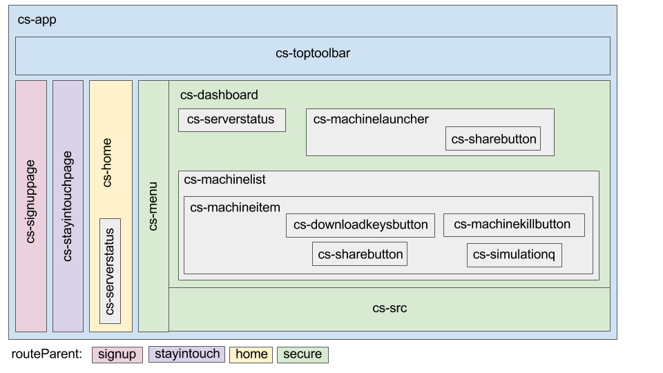

[Back to Home](Home)

# Developing the GUI

CloudSim's GUI uses the
[Polymer](https://www.polymer-project.org/1.0/)
platform for web components.

CloudSim is composed of several web-components, each of them performing one
especialized task. The components are divided into two groups, according to
their prefix: `gz-` or `cs-`.

# Component types

## gz-*

`gz-` components:

* Provide an interface to servers.
* Are not meant to display information.
* Expose a clear and simple API which which other components can use.
* Are general and not tied to the cloudsim app.
* Each component is hosted at its own repository and can be released separately.
* When released, any polymer app can use the component simply by referencing it
in `bower.json`. No need to clone the repo.

[Here](https://github.com/osrf?utf8=%E2%9C%93&query=gz-) you can see all `gz-`
components.

## cs-*

`cs-` components:

* Are specific for the cloudsim app.
* Handle very little logic, are there mostly to display and organize information.
* Have no direct communication with servers.
* Are all hosted in the `cloudsim-widgets` repository and never released.

[Here](https://bitbucket.org/osrf/cloudsim-widgets/src/default/app/elements/)
you can see all `cs-` components.

## gz-account + cs-signuppage example

* Target server: `cloudsim-auth`

* Purpose: create accounts

* [`gz-accounts`](https://github.com/osrf/gz-accounts/blob/master/gz-accounts.html)
's role: Send REST requests to the server.

* [`cs-signuppage`](https://bitbucket.org/osrf/cloudsim-widgets/src/default/app/elements/cs-signuppage/cs-signuppage.html)
's role: User interface for input and feedback.

* Usage:

  1. Import both components in
  [`app/elements/elements.html`](https://bitbucket.org/osrf/cloudsim-widgets/src/default/app/elements/elements.html?fileviewer=file-view-default)
  . Note the different paths for `gz-` and `cs-`.

        <link rel="import" href="../bower_components/gz-accounts/gz-accounts.html">
        <link rel="import" href="cs-signuppage/cs-signuppage.html">

  1. Instantiate `gz-accounts` within `cs-signuppage`. The parameters passed in
  are the auth server's `url` and a callback for when registration is complete
  (`on-register`). The `id` will be used to access the component in the
  javascript code.

        <gz-accounts
          id="accounts"
          url=[[url]]
          on-register="onRegister"
        ></gz-accounts>

  1. `cs-signuppage` provides input fields for name and password:

        <paper-input label="User name" id="user"></paper-input>
        <paper-input label="Password" id="pass1" type="password"></paper-input>
        <paper-input label="Confirm password" id="pass2" type="password"></paper-input>

  1. Once the user submits, `cs-signuppage` calls `gz-accounts`'s function:

        this.$.accounts.registerUser(user, pass);

  1. When the account has been created, `gz-accounts` fires an event which
  triggers the `onRegister` callback in `cs-signuppage`.

  1. `cs-signuppage` fires an event so the toast notifies success or error.

# Development

## **Tip 0**: What do you want to do

* Add new static content / reorganize existing functionality

    * Create a `cs-` component
    * Edit existing `cs-` components

* Add dynamic interface for features already exposed by the servers, but not
yet displayed in the GUI.

    * Create new `gz-` component which talks to the server
    * Create new `cs-` component which uses the `gz-` component's interface

* Add completely new functionality which no server is doing

    * Create a new server, `gz-` and `cs-` components
    * Add functionality to server, create new `gz-` and `cs-`

These are just very general guidelines. Most cases might require a different
set of actions.

## **Tip 1**: Use public servers

Since our focus is on the widgets side, we don't need to worry about launching
local auth and portal servers. So we can set our cloudsim-widgets `.env` file
to use the public servers as explained [here](Running).

> When using public servers, be mindful of machines that had been launched
> before you started, other developers might be working on them.

## **Tip 2**: Run the server

First move into the widgets directory:

    cd cloudsim-widgets

There are two ways to run the servers:

* `gulp serve`: Good for debugging, but slow to load. See BrowserSync below.

* `gulp serve:dist`: Good for production, all the code is optimized in a process
called "vulcanize".

## **Tip 3**: BrowserSync

By default, BrowserSync is at work while the server is up. Whenever you make a
change to the source code, the browser will refresh and you can see the results
immediately.

Another BrowserSync feature is that whatever you do in one browser will be
reflected on all other open browsers running the app. This might make it
difficult to test two different users at the same time, and can cause some
actions to be performed twice if you accidentaly forgot another browser open.

You can configure BrowserSync at [http://localhost:3001/](http://localhost:3001/).

## **Tip 4**: Modifying a `cs-` component

1. All `cs-` components can be found at `cloudsim-widgets/app/elements`

1. The `cs-` components are currently structured as follows:

    

1. Edit a component

1. Make a pull request to cloudsim-widgets. When merged into default, Codeship deploys
the updated version to
[https://cloudsim.io:5000](https://cloudsim.io:5000).

## **Tip 5**: Creating a `cs-` component

1. Move to the app directory:

        cd cloudsim-widgets/app

1. Create directory for new component:

        mkdir elements/cs-componentname

1. Copy template component:

        cp elements/cs-template/cs-template.html elements/cs-componentname/cs-componentname.html

1. Search and replace all `cs-template` with `cs-componentname` in the html file.

1. Add link import for `cs-componentname` in `elements/elements.html`

1. Go to the component where you want to place `cs-componentname` and insert its tag:

        <cs-componentname/>

1. When running the server, you'll see a button that says `template`. Tapping it
displays a notification.

1. Don't forget to add a basic loading test for your component:

        cp test/cs-template-basic.html test/cs-componentname-basic.html
        gedit test/cs-componentname-basic.html
        # Search and replace cs-template with cs-componentname

1. The rest is polymer...

1. Make a pull request to cloudsim-widgets. When merged into default, Codeship deploys
the updated version to
[https://cloudsim.io:5000](https://cloudsim.io:5000).

## **Tip 6**: Use official components

See the catalogue of official polymer components
[here](https://elements.polymer-project.org/browse?package=paper-elements).

When using a new component, don't forget to add it to `app/elements/elements.html`.

## **Tip 7**: Modifying a `gz-` component

1. You can edit the component in its directory.

1. Brief overview of existing `gz-` components:

## **Tip 8**: Creating a `gz-` component
